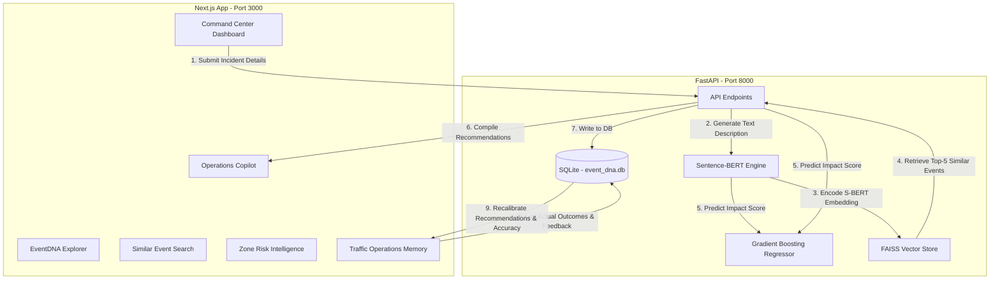

# EventDNA AI (GridLock)

EventDNA AI is a self-learning event impact intelligence and traffic operations copilot built for the Astram event traffic operations platform. The system uses sparse multimodal event data (combining structural event details with natural language description embeddings) to predict traffic impact scores, recommend tactical dispatch resources, and continuously improve through a post-event learning feedback loop (Traffic Operations Memory).

---

## 1. System Architecture



---

## 2. Key Modules & Features

1. **Command Center**: Live incident logger and rapid dispatch dashboard.
2. **EventDNA Explorer**: Inspects how semantic text representations are compiled and visualizes S-BERT embedding vector dimensions.
3. **Similar Event Search**: Executes interactive text and semantic queries to search nearest matching events in the FAISS index.
4. **Operations Copilot**: Displays tactical dispatch resource recommendations (officers, patrols, barricades) based on historical successful matches, alongside a resource multiplier simulation slider.
5. **Zone Risk Intelligence**: Computes risk indices for zones based on historical congestion patterns.
6. **Traffic Operations Memory (TOM)**: Post-event operational feedback logging and accuracy tracking system that allows the model to learn dynamically from actual outcomes.

---

## 3. Tech Stack

- **Frontend**: Next.js 15+, TypeScript, Tailwind CSS, Lucide React, Recharts.
- **Backend**: FastAPI, Python 3.10+, Uvicorn.
- **ML / AI Engine**:
  - **Sentence-BERT** (`all-MiniLM-L6-v2` via `sentence-transformers`) for text embeddings.
  - **FAISS** (`IndexFlatL2`) for sub-millisecond dense vector similarity search.
  - **Gradient Boosting Regressor** (`scikit-learn` / `XGBoost` style) for event impact forecasting.
  - **SQLite** (`event_dna.db`) for relational event history, memory logs, and metrics tracking.

---

## 4. Run Instructions

### Start the FastAPI Backend
Initialize and start the FastAPI server on port 8000:
```powershell
python -m uvicorn backend.app.main:app --host 127.0.0.1 --port 8000
```

### Start the Next.js Frontend
Start the Next.js development server on port 3000:
```powershell
cd frontend
npm run dev
```

*Note for Windows users:* If PowerShell blocks executing script commands due to execution policy limits, start the frontend using:
```powershell
cmd /c npm run dev
```

Open [http://localhost:3000](http://localhost:3000) in your browser.
